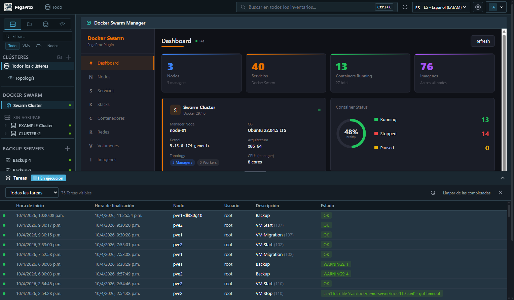
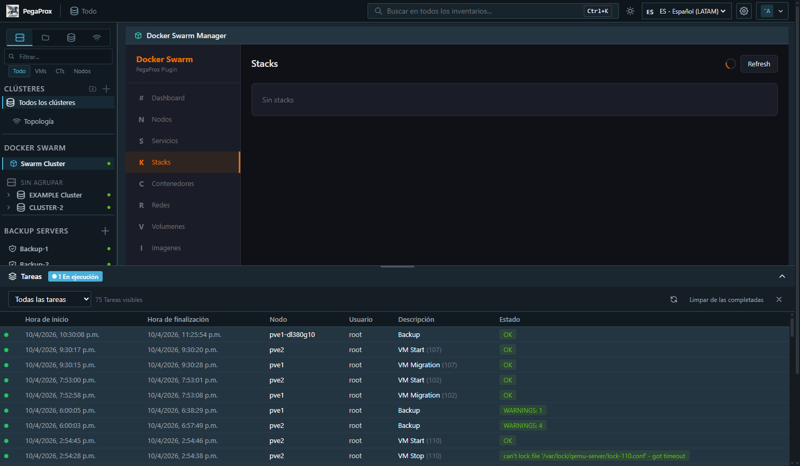
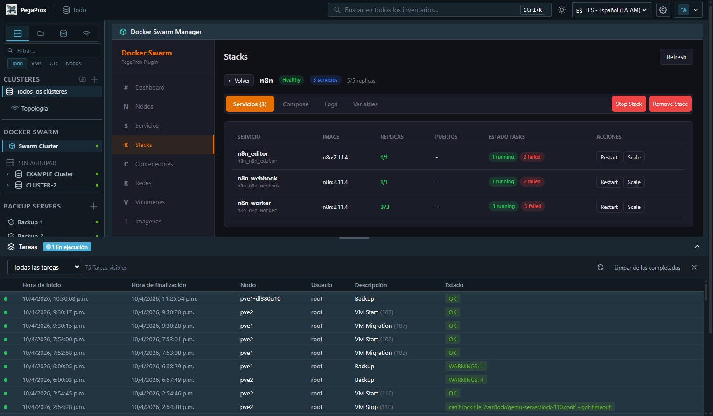
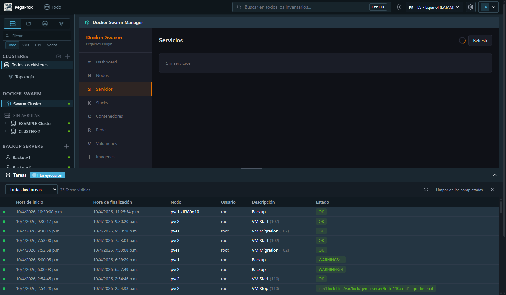

<p align="center">
  
</p>

<h1 align="center">PegaProx Docker Swarm Manager Plugin</h1>

<p align="center">
  <strong>Monitor and manage Docker Swarm clusters directly from PegaProx</strong>
</p>

<p align="center">
  
  
  
  
</p>

---

## What is this?

A PegaProx plugin that brings Docker Swarm cluster management into PegaProx's interface. Connect to your Swarm manager nodes via SSH and get full visibility and control over your Docker infrastructure — without leaving PegaProx.

Born from [Feature Request #152](https://github.com/PegaProx/project-pegaprox/issues/152) on the PegaProx project.

## Screenshots

### Dashboard
<p align="center">
  
</p>

### Stacks
<p align="center">
  
</p>

### Stack Detail
<p align="center">
  
</p>

### Services
<p align="center">
  
</p>

## Features

| Feature | Details |
|---------|---------|
| **Dashboard** | Swarm overview with node resource metrics (CPU load, RAM, Disk), container counts, disk usage, auto-refresh |
| **Nodes** | List all Swarm nodes with status, availability, role, engine version, IP, CPU cores, RAM |
| **Services** | Full service listing with stack, image, replicas, ports. Actions: Tasks, Logs, Scale, Restart, Remove |
| **Stacks** | Stack listing with service counts. Deploy from YAML, remove stacks |
| **Containers** | Container listing with status, ports. Actions: Start, Stop, Restart, Logs |
| **Networks** | Docker networks (overlay, bridge, etc.) |
| **Volumes** | Docker volumes with driver and mountpoint |
| **Images** | All images with repository, tag, ID, size |
| **Settings** | Configure SSH hosts, test connections, set polling interval |
| **Audit** | Grade every service A–F against 10 best-practice policies (anti-affinity, reservations, image pinning, healthcheck, …) with per-finding fix hints |
| **Trends** | 30-day rolling history of per-node CPU/RAM/tasks. Sparklines on Balance cards + dedicated Tendencias tab with 1h/6h/24h/7d/30d windows |

## Installation

### One-Line Install (Recommended)

```bash
curl -sSL https://raw.githubusercontent.com/alfonsokuen/pegaprox-docker-swarm/main/install.sh | sudo bash
```

The installer will:
- Download the plugin
- Prompt for your Swarm manager SSH credentials
- Enable the plugin in PegaProx
- Integrate into the sidebar and topology view
- Optionally set up nginx reverse proxy (for VNC console)
- Configure auto-patch for PegaProx update persistence
- Rebuild the frontend and restart PegaProx

### Manual Install

```bash
cd /opt/PegaProx/plugins/
git clone https://github.com/alfonsokuen/pegaprox-docker-swarm.git docker_swarm
cp docker_swarm/config.example.json docker_swarm/config.json
# Edit config.json with your Swarm SSH credentials
chown -R pegaprox:pegaprox docker_swarm/
chmod 600 docker_swarm/config.json
# Enable: Settings > Plugins > Rescan > Enable "Docker Swarm Manager"
# Integrate into sidebar + topology:
sudo bash docker_swarm/patch-pegaprox.sh
```

### Uninstall

```bash
sudo bash /opt/PegaProx/plugins/docker_swarm/uninstall.sh
```

## Configuration

Edit `config.json` or use the **Settings** tab in the plugin UI:

```json
{
    "swarm_hosts": [
        {
            "name": "Manager-1",
            "host": "192.168.1.10",
            "user": "your-user",
            "password": "your-password"
        }
    ],
    "poll_interval": 30
}
```

You can add multiple hosts for redundancy. The plugin uses the first available manager.

## Architecture

```
docker_swarm/
├── __init__.py          # Backend: 24 API endpoints, SSH via paramiko, caching, background polling
├── swarm.html           # Frontend: React SPA with sidebar, tables, modals, log viewer
├── manifest.json        # Plugin metadata
├── config.json          # SSH host configuration (chmod 600!)
└── config.example.json  # Example configuration template
```

### How it works

1. **SSH Connection**: Connects to Swarm manager nodes via paramiko (included in PegaProx)
2. **Docker CLI**: Executes `docker` commands with `--format json` for structured output
3. **Caching**: 15-second TTL cache to reduce SSH overhead
4. **Background Polling**: Refreshes overview, nodes, services, and stacks periodically
5. **PegaProx Integration**: Uses `register_plugin_route()` for seamless API integration with auth

### API Endpoints (24 total)

All endpoints prefixed with `/api/plugins/docker_swarm/api/`

| Method | Path | Description |
|--------|------|-------------|
| GET | `/ui` | Plugin HTML UI |
| GET | `/overview` | Swarm dashboard data |
| GET | `/nodes` | Swarm nodes list |
| GET | `/node-stats` | CPU/RAM/Disk per node |
| POST | `/node-action` | Drain/active/pause node |
| GET | `/services` | All services with details |
| GET | `/stacks` | All stacks |
| GET | `/containers` | All containers |
| GET | `/networks` | Networks |
| GET | `/volumes` | Volumes |
| GET | `/images` | Images |
| GET | `/tasks?service_id=X` | Service tasks |
| GET | `/service-logs?service_id=X` | Service logs |
| POST | `/service-scale` | Scale service replicas |
| POST | `/service-restart` | Force-update service |
| POST | `/service-remove` | Remove service (admin) |
| GET | `/container-logs?container_id=X` | Container logs |
| POST | `/container-action` | Start/stop/restart container |
| POST | `/stack-deploy` | Deploy stack from YAML (admin) |
| POST | `/stack-remove` | Remove stack (admin) |
| GET | `/config` | Plugin config (admin) |
| POST | `/config/save` | Save config (admin) |
| POST | `/test-connection` | Test SSH connection |
| POST | `/refresh` | Clear cache |
| GET | `/policy/audit[?service=X]` | Cluster (or single-service) policy audit + grade |
| GET | `/policy/checks` | Catalog of audit checks + severity legend + grade rubric |
| POST | `/policy/apply` | Apply auto-fix for one (service, check_id). Body: `{service_name, check_id, confirm}`. Admin. |
| GET | `/policy/appliers` | Catalog of which checks have a programmatic fix (4 of 10) |
| GET | `/metrics/history?host=X&metric=cpu_percent&duration=24h` | Time-series for one (host, metric) over the window |
| GET | `/metrics/trends?duration=24h` | Per-node summary stats (avg/max/current) over the window |
| GET | `/balance/insights` | Why the cluster isn't balanced + which services can be moved |
| POST | `/balance/rebalance-all` | Body: `{dry_run, max_services, delay_sec}`. Admin. Async — returns `{job_id}` immediately; force-updates run in a daemon thread. |
| GET | `/balance/rebalance-status[?job_id=X]` | Live status of one job (or list of all jobs). Returns progress %, ETA, per-service results. |

## Requirements

- **PegaProx** 0.9.0+ (uses paramiko, Flask, plugin API)
- **Docker Swarm** cluster with SSH access to at least one manager node
- SSH user must be able to run `docker` commands (in the `docker` group)

## Security

- SSH credentials stored in `config.json` with restricted permissions (600)
- All API endpoints require PegaProx authentication (`plugins.view`)
- Destructive actions require admin role
- Input sanitization to prevent command injection
- Passwords masked in API responses
- All actions logged via PegaProx audit system

## Comparison with Portainer

| Feature | Portainer | This Plugin |
|---------|-----------|-------------|
| Dashboard with metrics | Yes | Yes |
| Service CRUD | Yes | Yes |
| Stack deploy/remove | Yes | Yes |
| Container actions | Yes | Yes |
| Log viewer | Yes | Yes |
| Networks/Volumes/Images | Yes | Yes |
| Node management | Yes | Yes |
| Exec into container | Yes | No |
| Registry management | Yes | No |
| Integrated in PegaProx | No | **Yes** |
| No extra containers needed | No | **Yes** |

## Contributing

Pull requests welcome! Test with PegaProx 0.9.5+.

## License

MIT License - see [LICENSE](LICENSE) for details.

## Credits

- Built for [PegaProx](https://github.com/PegaProx/project-pegaprox) plugin system
- Inspired by [Portainer](https://www.portainer.io/) and [Feature #152](https://github.com/PegaProx/project-pegaprox/issues/152)
